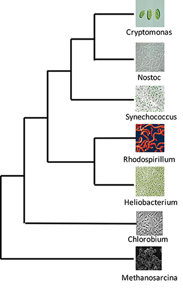

## Getting the data

1. Go to the supplemental materials of Hug et al. 2016: [link](https://www.nature.com/articles/nmicrobiol201648#supplementary-information)
2. Download **Supplementary Dataset 2** (the tree in a text format called `Newick` format) by right-clicking the link and choosing **Save link as...** which will allow you to save it as a text file (the name does not matter, just make sure you find it again for the next step).

## Loading the tree

1. Go to the interactive tree of life: [iTOL](http://itol.embl.de/).
2. Click on [**Upload**](http://itol.embl.de/upload.cgi) in the top menu.
3. Give the tree a name (e.g. `Tree of Life`) and upload the **Supplementary Dataset 2** that you downloaded.

## Customizing the visualization

1. In `Controls -> Basic`, switch **Display Mode** to `Unrooted`
2. In `Controls -> Basic`, switch **Parameters** to `270` degrees rotation
3. In `Controls -> Advanced`, switch **Leaf Sorting** to `None`
4. Start to look familiar?

## Pruning the tree

This tree has way more information than we want at the moment. Time to prune it.

For each of our 7 genera (Chlorobium, Cryptomonas, Heliobacterium, Methanosarcina, Nostoc, Rhodospirillum, Synechococcus), pick a close representative to prune the tree.

1. In `Controls --> Basic`, switch **Display Mode** to `Normal` (this is easier for pruning)
1. In the left controls `Search the tree` and enter the name of genus
2. If there is a close representative, click on it to highlight the branch in the tree
3. If there are no search results (it would be impossible to include everything in a tree like this, relatively closely related groups are usually grouped together or included via a single representative), see if you can find out what the next closer group is using the NCBI Taxonomy browser:
   - go to [www.ncbi.nlm.nih.gov/taxonomy/](https://www.ncbi.nlm.nih.gov/taxonomy/)
   - enter your search term/organism (e.g. **Monkey**)
   - this will bring up the scientific name(s) of the organism
   - click on the scientific name to get the full lineage (and a long list of representative organisms)
   - at the top under **Lineage**, you will see the parent groups from the root (e.g. `cellular organisms`) to the tip (the organism or group you searched for)
   - see if you can find one of the parent groups (from back to front, i.e. from less broad to more broad) in the tree of lifestyle
4. Once you found the branch you are looking for, click on it (check in the mouse-over that it is indeed what you are looking for), and select `Add leaf/node to pruned tree`

Repeat this for all 7 genera. Then:

 - add 3 more species/genera of your choice (select any branches that sound interesting to you or use the taxonomy browser to find the scientific names of organisms you are interested in). Again, not everything will be present in the tree, relatively closely related groups are usually grouped together or included via a single representative.
 - click on `Prune tree` to prune your tree when ready (warning: you cannot easily undo this, need to restart with the big tree)

## Discussion questions

How does the tree compare to the manual tree we made?

1. What did the 20 amino acid sequence from the 16S ribosomal RNA gene get right?
2. What did it get wrong?
3. What is the most striking difference?

#### Additional information

Play with the settings in `Controls -> Advanced`: **Branch lengths**, **Bootstrap**, **Internal node symbols**, **Internal tree scale**:
1. What is the bootstrap value of the node between the Cyanobacteria and the other bacteria?
2. What are the branch lengths telling you?

## Beautifying your tree

As a team, make your tree more visually appealing by playing with

 - the `Controls` (circular, normal, inverted vs. non-inverted, etc., whatever you like better to visualize the relationships)
 - clicking on the `Tips` and simplifying the labels (`Label -> Edit`), colors (`Color -> New color range`), and/or line styles (`Style`)

## Submitting your team tree

To get full credit for this in-class activity, submit at least one tree from your team by adding it to your team's [tree repository](https://classroom.github.com/g/9nWtA6xT) by the end of the day and submit using the `submit` branch as usual.

You can export the tree in `Controls -> Export` for addition to your repository as a **PNG: Portable Network Graphics** for graphical output and as a **Text: Newick tree** file for saving the structure of the tree (which you could re-use in [iTOL](http://itol.embl.de/) at a later point if so inclined). Please add both the `.png` and the `.txt` (with sensible file names) to the `trees` folder in your repository and link them in the `molecular_trees.md` assignment file.

*Side note: if you want to save a tree with all its visualization parameters, you have to [create a personal ITOL account](http://itol.embl.de/itol_account.cgi) which then allows you to save and share all kinds of tree visualizations.*
